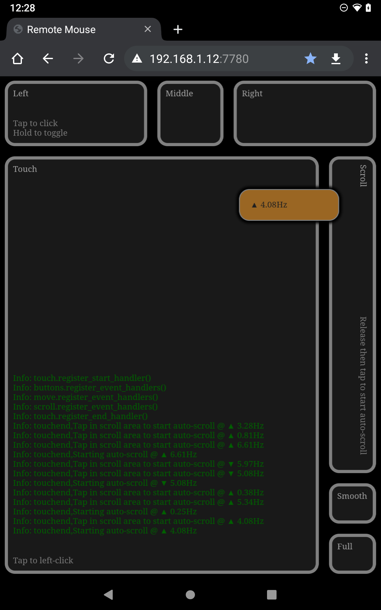

# Floating Pointer 🙃



Use your phone or tablet as a fast and accurate virtual mouse for your desktop PC. Should work on most recent Linux, Windows and Mac machines.

Runs directly in the browser, so there's no app to install on your device. Free and open source. Connects your device directly to your PC over your local network. There are no other services involved. Internet connection not required.

## Usage

1. Start `floating-pointer` on your desktop machine, and note the local link it displays.
2. Open the browser on your device and type in the link.
3. Enjoy!

#### Mouse Pointer

- The mouse pointer is controlled by a virtual trackball (think old arcades like Marble Madness and Spindizzy).
 
  Swipe and _release_ in the `Touch` area to spin the trackball, sending the mouse pointer flying to where you need it to be.
  
  _Hold_ to stop the pointer and bring it under direct control, then _drag_ to move it to the desired location.

- This system resolves the issue that many virtual mice have, which is that either moving is slow, or positioning is inaccurate.

- Tapping anywhere in the `Touch` area performs a left mouse button click, so moving the pointer is often followed by a _release_ and _tap_ at the location one is already touching. Then, still from the same location, the pointer can be sent towards the next location with a new swipe.

#### Buttons

- Click the left-, middle- and right mouse buttons by tapping in the `Left`, `Middle` and `Right` areas.

- The left mouse button can also be clicked by tapping in the `Touch` area.

- Keep a mouse button pressed by touching the button area until it lights up. Tap anywhere to release the button.

- Double-tap a button to double-click it.

#### Mouse wheel scrolling

- _Drag_ up or down in the `Scroll` area to start scrolling. Increase the speed by dragging away from the starting point. Then _hold_ to keep scrolling. (You may have to hover the mouse pointer over the are to scroll first).

- Notice that movement is only required when you want to change the speed or direction. This is different from most mice and touchpads, which require some sort of continuous movement in order to keep scrolling.

#### Browser smooth scrolling

- Mouse wheel scrolling moves in small jumps, which is not ideal for those hours of doomscrolling bliss, so this app has a mode that triggers smooth scrolling in the browser.

  This function depends on functionality that is built into Firefox. To use this with Chrome, install the SmoothScroll extension, available in the Chrome Web Store.

  To tell if it will work in your browser, try to drag in a web page while holding the middle mouse button, either using this app or a regular mouse. This app just emulates that action.

  To use this function with Firefox, enable both `Use autoscrolling` and `Use smooth scrolling` in the Firefox settings (they're under `Browsing`, near the end of the `General` section). Then tap the `Smooth` button in the lower right in the app UI.
  
  Notes:
  
    - The mouse pointer may appear to flicker when starting to scroll with this method. This is to prevent the browser from interpreting brief scrolling as just the start of a scroll. Most of the time this works, but if it doesn't, you may have to start and stop a new scroll in order to synchronize the browser with your actions.
  
    - In both Firefox and Chrome, smooth scrolling will not start if the pointer is hovering over a link. That's because this type of scrolling is triggered using the middle mouse button, while middle mouse button click on a link opens links in new tabs.

#### Auto scrolling

- So we can now scroll smoothly through infinite feeds, but in our Quest for the Ultimate Doomscrolling Experience, having to keep a finger on the screen will get old quickly. So this app has mode where the mouse wheel scroll and browser smooth scroll modes (described above) can be toggled on.

- To activate this mode, start one of the previous scroll modes, dial in the speed you want, then release and tap the scroll bar.

- Auto scrolling can be started with a tap at any time and will use the previous manual speed, as long as the app hasn't been restarted in-between. In that case, auto scroll starts at the not-very-useful speed of zero point zero.

- Tap anywhere to stop auto scrolling. The scroll also stops if you close the web app or if the connection to the desktop computer is lost.

- If your computer seems to have a mind of its own and keeps scrolling things around the day after you used this function, your are advised to check to see if you forgot to turn the scrolling off :)

## Tips

- When stopping the pointer after a spin, make sure you _hold_, not _tap_. A _tap_ will stop the pointer, but will also cause a spurious click at the stopped position.

- Touches in the `Touch` and `Scroll` areas only have to start in the areas. They still register if the touch moves into another area.

- Using a drag operation to select text is cumbersome without a real mouse. Fortunately, even if there is no visible caret, there may be an invisible one. So text can be selected as if there is a caret.

  Firefox and Chrome supports selecting text by clicking at one end of the selection, then holding shift while clicking at the other end. Firefox also supports creating a selection with one click then using Shift + arrow keys to make the selection.

  Firefox and Chrome both also have caret browsing modes, which can be toggled on and off with F7.
  
  In some windows, such as error dialog boxes, you can also try to copy the text without selecting it first, by just clicking in the window and pressing Ctrl+C.

- Enter full screen mode by tapping the `Full` button. This issues a request for full screen to the browser. The request may be ignored, in which case the button will not cause any change. If full screen mode is activated, a swipe from the top or bottom of the screen will normally exit back to regular mode.

### Configuration

#### Friction and inertia

- The friction and sensitivity settings that control mouse pointer movement after releasing the touch are command line arguments. E.g.,:

      $ cargo run -- --friction 0.01 --sensitivity 0.1

  - To have the mouse pointer stop immediately when the touch is released, set the friction to `1.0`.

  - Sensitivity for the other controls, and related settings can be modified by changing the `const` values in `web/settings.js`.

#### Sensitivity

- `TOUCH_MOVE_SENSITIVITY`
- `WHEEL_SCROLL_SENSITIVITY`
- `SMOOTH_SCROLL_SENSITIVITY`

  - Input values are multiplied with these before they're used. Higher values increase sensitivity (less movement is required on the touchpad).

#### Tap / hold / swipe durations

- `TAP_DURATION_MS`
- `TAP_RADIUS_PIXELS`

  - These provide the time and radius where a touch transitions from a tap to a hold or swipe.
  
  - Try adjusting these if the mouse buttons are hard to toggle or otherwise seem finicky.


#### Mouse buttons
  
- `TOUCH_LEFT_CLICK`

  - Enable Touch area to also pick up left clicks.

#### Suppression of unintended movements

Suppress mouse pointer movements that occurred while a touch was being released.

    TODO: This setting is not implemented yet.
    Currently using an ad-hoc suppression method. 

- `RELEASE_DURATION_MS = 1000`

  - Touch screens often register random small movements while a touch is being released. This setting prevents those from nudging the pointer off the point one is intending to click.
    
    The setting is the number of milliseconds of mouse pointer movement to suppress before a release was detected. 
    
    It works by "rewinding" the mouse pointer movements that occurred just before a release was detected. Since we cannot know when a release will occur, this setting is also the amount of time for which a history of mouse pointer movements will be maintained.
    
#### Misc

- `SCROLL_INTERVAL_MS`

  - Period in ms, determines the frequency at which user input is evaluated and event trigger frequency is adjusted:

- `WEB_SOCKET_TIMEOUT_MS`

  - Wait, in ms, between each attempt to reconnect a lost WebSocket connection to the desktop.

- `ENABLE_MYSTERY_RUNES`

  - Enable drawing symbols to indicate user input and triggered actions.
  
## Host security considerations

Anyone that can connect to the WebSocket that Remote Mouse opens on the desktop PC can control the mouse. It's remotely conceivable that this could be used in an attack where the attacker guesses what's on the monitor (to determine where to click), or can see the monitor through a window, or just clicks randomly to break things. If this is of concern, access to the port should be restricted, for instance with firewall rules, or by setting floating-pointer to listen only on a localhost port, and accessing it via an SSH tunnel.

## Installation

#### Build on Linux

This procedure has been tested on Linux Mint 19 and 20. It should work on recent Ubuntu and other Debian derivatives as well.

You need Rust for building this. Rust usually installs with a single command, as described at:

https://www.rust-lang.org/tools/install

Then:

```shell
$ sudo apt install libxdo-dev
$ bash -c '
git clone https://github.com/rogerdahl/floating-pointer
cd floating-pointer
cargo run --release
'
```

- The link to use for connecting from the phone or tablet is printed to the shell.

## Permissions

This program injects mouse events by writing to `/dev/uinput`. On most systems, only root can write to this device by default. To add write permissions to your user account:

```shell
bash -c '
sudo groupadd --system uinput-users
sudo usermod -a -G uinput-users $USER
sudo cat<<END>>/etc/udev/rules.d/90-uinput.rules
KERNEL=="uinput", GROUP="uinput-users", MODE="0660"
KERNEL=="uhid", GROUP="uinput-users", MODE="0660"
END
'
```

Reboot to activate.

## Technologies

- `Rust`,
  `tokio`,
  `warp`,
  `enigo`,
  [`vh-check`](https://github.com/Hiswe/vh-check),
  [`CSS Stripes Generator`](https://stripesgenerator.com/) and the usual suspects,
  `ES6`,
  `CSS`,
  `jQuery`, and 
  `jQuery UI`.

## TODO

- Option to protect the service with password or PIN.
- On-device configuration screen.
- Separate configurations for multiple users.
- Option to export options and import them on another machine.
- Run as service on the host (with automatic start after boot).
- Native installers for supported platforms.

## Related projects

Free and commercial, misc platforms. 

- rkvm - https://github.com/htrefil/rkvm • https://www.reddit.com/r/rust/comments/jlhga1/rkvm_a_tool_to_share_keyboard_and_mouse_over_the/
- Simple Computer Remote - http://www.rpiblog.com/2013/11/using-android-as-wireless-mouse-keyboard.html
- Barrier - https://www.raspberrypi.org/blog/share-your-keyboard-and-mouse-between-computers-with-barrier/
- Remote Mouse - https://www.remotemouse.net/ • https://www.exploit-db.com/exploits/46697
- Unified Remote - https://www.unifiedremote.com/ 
- Mobile Mouse - https://mobilemouse.com/
- WifiMouse - https://wifimouse.github.io • https://www.thewindowsclub.com/wifimouse-phone-wireless-mouse-for-windows
- Aexol Remote Mouse - https://formulae.brew.sh/cask/aexol-remote-mouse
- Simple Computer Remote - https://philproctor.github.io/SimpleComputerRemote/
- CouchLover - https://github.com/dotKokott/CouchLover
- cAndroid / Control via Android - https://github.com/hummatli/cAndroid

- Gorm Remote Mouse - https://play.google.com/store/apps/details?id=uk.co.lcstudios.mouseemulator&hl=en_US&gl=US
- Lazy Mouse - https://play.google.com/store/apps/details?id=com.ahmedaay.lazymousepro&hl=en_US&gl=US

## Implementation notes

#### Spin heuristics

- When the user starts a spin, it's essential that we set the pointer speed and direction as accurately as possible. I found that we need to select the fraction of a second of user input that occurred just before the touch was released, and we need to discard any earlier user input that may have been part of the same swipe, but was just the user moving the mouse before deciding to start the spin. 

  To find the point at which the user started the spin, we start at the end of the swipe, and move backwards in the history of user input while applying two heuristics:
  
  1) We expect the swipe that starts a spin to speed up until relase. So we check for the speed of movement along the history. As long as the speed doesn't slow down (with some toleranse), when seen related to moving forwards in time, we keep searching. If it starts slowing down, we stop the search and set that point as the start of useful input.
  
  2) We expect the swipe to be a fairly straight line, indicating the direction the user wants. So we keep searching as long as line segments between positions in the history form a fairly straight line. We break off when two segments join with too much of an angle.

  The heuristics are applied at the same time, and whichever stops the search first is the deciding one. 

#### Rounding errors

Enigo, which wraps Xdo on Linux, supports both absolute and relative mouse pointer positioning. Both methods take integers, which describe positions with resolution of 1 pixel.

The main drawback of absolute positioning is that the app has to detect (or the user has to provide), the resolution of the desktop. It also requires some slight workarounds due to the different resolutions and sizes of the desktop and touch screen. The issues aren't a big deal, but relative positioning seems like it's a better fit for this app.

With relative positioning, we send a series of deltas describing the difference between the previous and current pointer positions. To get responsive and smooth operation, we send deltas at a fairly high frequency (120 per second by default), which means that the pointer often moves only a few pixels between each delta, often giving delta with values somewhere between -5 to +5 in each direction (x and y).

Since these values are also integers describing full pixel movement, we are left without enough resolution to accurately move the mouse pointer by repeating just one delta.

The delta is essentially a vector, describing both the direction and speed of the pointer. And, because the speed and direction are baked together into two integers, the resolution in specifying the direction becomes very low when the speed is low. For instance, using a delta of (1,1) (1 pixel down and one pixel to the right), causes the pointer to move at a 45 degree angle. The next possible angle is created by varying the value for one of the dimensions by one. E.g., by changing the delta to (2,1), which gives a 60 degree angle. So no angles between 45 and 60 degrees can be represented while also keeping mouse pointer speed the same. To represent other angles, both of the values in the delta would have to be increased, so as to provide a fraction between those lower ones. But that's not an option since it would speed up mouse pointer movement, and we need to speed of the movement to correspond with the speed at which the user wants to move the pointer.

The lack of resolution is that the mouse pointer ends up looking like it's dropping into invisible tracks as it moves, where the tracks correspond to the few angles that can be achieved with very small delta values.

So, in order to provide smooth movement at the speed set by the user, we need to use float values in the deltas. But Enigo takes only integers, and if we just round or truncate the floats before passing them on, we haven't gained anything.

We resolve this by keeping track of the errors that are introduced by truncating the floats, and rolling them back into the mouse position when they're large enough.
 
 Instead of throwing out the fractional parts of truncated values (which will be in the [0.0, 1.0) range), we add them to a running total, called the cumulative error.
 
 The cumulative error represents the error we have introduced by truncating the floats so far. It is also the difference between the current actual position of the pointer and the position it would have been in, if sub-pixel positioning was supported.
 
 Each time we add another rounding error to the cumulative error, we check if the value has become 1.0 or larger, which means that it has an integer part that we can now split out and send to Enigo.
 
 Finally, sending the value to Enigo adjusts the pointer position, cancelling out the rounding errors.
 
 Since we're evaluating the error in the context of sending another delta to Enigo, we just add the integer parts to the delta on which we're working, instead of sending it separately.
